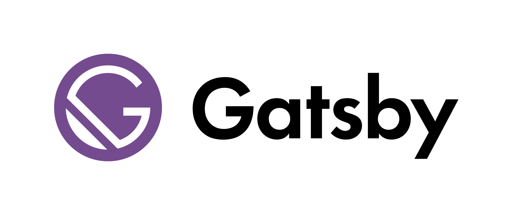
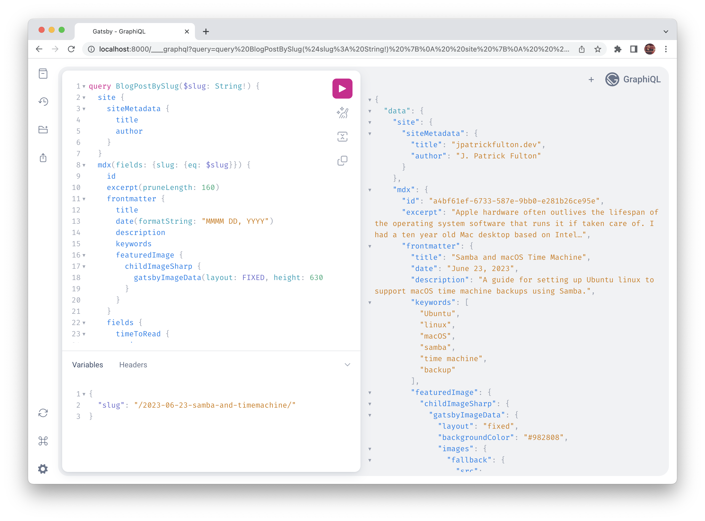

I ran across [GatsbyJS](https://www.gatsbyjs.com/) in a
[video](https://www.youtube.com/watch?v=IZbcpUIke8s&list=PLlrxD0HtieHgMPeBaDQFx9yNuFxx6S1VG)
on [Azure Static Web Apps](https://azure.microsoft.com/en-us/products/app-service/static)
which I have been using for a variety of projects and quickly became impressed with
the framework and the open source ecosystem around it. After a few test runs,
I selected it as the engine for this blog.

> Gatsby enables developers to build fast, secure, and powerful websites using
> a React-based framework and innovative data layer that makes integrating
> different content, APIs, and services into one web experience incredibly simple.



Features that I was seeking for my implementation included:

- **Blazing** speed and optimization for [Core Web Vitals](https://web.dev/vitals/#core-web-vitals)
- [Search Engine Optimization](https://en.wikipedia.org/wiki/Search_engine_optimization)
- [Sitemap](https://developers.google.com/search/docs/crawling-indexing/sitemaps/overview)
  generation
- [Web manifest](https://web.dev/add-manifest/) and
  [Progressive Web App](https://web.dev/progressive-web-apps/) support
- Automated image optimization
- Complete control over customization
- A familiar component framework ([React](https://react.dev/))
- [Markdown](https://www.markdownguide.org/) as they primary platform for content
  authoring

The evolving **GitHub repository** storing this blog and its implementation can be
found [here](https://github.com/jpfulton/blog).

## Table of Contents

## Key Package Versions

I enjoy both the occasional pain and benefits of staying on the bleeding
edge with personal projects. As a result, I started with very current versions
of several key Gatsby packages. At the time of this writing, some of those
packages were released in the [last several weeks](https://www.npmjs.com/package/gatsby/v/5.11.0).
As a result, I reaped a number of benefits. However, several of the Gatsby starter
templates and a few plugins had a few issues that needed to be worked through.

```json:title=package.json {3,25,27,29,33}{numberLines: true}
"dependencies": {
    ...
    "gatsby": "^5.11.0",
    "gatsby-plugin-google-gtag": "^5.11.0",
    "gatsby-plugin-image": "^3.11.0",
    "gatsby-plugin-local-search": "^2.0.1",
    "gatsby-plugin-manifest": "^5.11.0",
    "gatsby-plugin-mdx": "^5.11.0",
    "gatsby-plugin-offline": "^6.11.0",
    "gatsby-plugin-react-helmet": "^6.11.0",
    "gatsby-plugin-sass": "^6.11.0",
    "gatsby-plugin-sharp": "^5.11.0",
    "gatsby-plugin-sitemap": "^6.11.0",
    "gatsby-plugin-styled-components": "^6.11.0",
    "gatsby-plugin-typography": "^5.11.0",
    "gatsby-remark-autolink-headers": "^6.11.0",
    "gatsby-remark-code-titles": "^1.1.0",
    "gatsby-remark-copy-linked-files": "^6.11.0",
    "gatsby-remark-images": "^7.11.0",
    "gatsby-remark-prismjs": "^7.11.0",
    "gatsby-remark-responsive-iframe": "^6.11.1",
    "gatsby-remark-smartypants": "^6.11.0",
    "gatsby-source-filesystem": "^5.11.0",
    "gatsby-transformer-sharp": "^5.11.0",
    "prismjs": "^1.29.0",
    ...
    "react": "^18.2.0",
    ...
    "react-dom": "^18.2.0",
    ...
},
"devDependencies": {
    "gatsby-cli": "^5.11.0",
    "gatsby-plugin-root-import": "^2.0.9",
    "prettier": "^2.8.8",
    "resolve-url-loader": "^5.0.0"
},
```

## Getting Started

This post assumes that a few things are in place in your development environment.
A good [quick start article](https://www.gatsbyjs.com/docs/tutorial/getting-started/part-0/)
is available on the Gatsby site.

- [Node.js](https://nodejs.org/en) v18 or newer
- [Git](https://git-scm.com/)
- A package manager is in place ([Yarn](https://yarnpkg.com/))
- An editor or IDE ([Visual Studio Code](https://code.visualstudio.com/))

### Install Gatsby Globally

It is best to install gatsby at a global level using your package manager
to get started.

```shell
yarn global add gatsby-cli
```

However, once you are up and running with fully initialized
repository it is possible to use a specific version controlled by your
`package.json` in your `devDependencies` section.

```json:title=package.json {2}{numberLines: true}
"devDependencies": {
    "gatsby-cli": "^5.11.0",
    "gatsby-plugin-root-import": "^2.0.9",
    "prettier": "^2.8.8",
    "resolve-url-loader": "^5.0.0"
},
```

### Using Starters

Gatsby and the community offer a series of [starters](https://www.gatsbyjs.com/starters/).
I pieced together a custom starting point by creating several starter sites
and pulling code from each into my own repository. Creating an example site
from a starter uses the following command:

```shell{outputLines: 2-29}
yarn gatsby new [NEW-SITE-NAME-HERE] [REPOSITORY-LINK-HERE]
info Creating new site from git:
https://github.com/gatsbyjs/gatsby-starter-blog.git

Cloning into 'example'...
remote: Enumerating objects: 41, done.
remote: Counting objects: 100% (41/41), done.
remote: Compressing objects: 100% (34/34), done.
remote: Total 41 (delta 1), reused 23 (delta 0), pack-reused 0
Receiving objects: 100% (41/41), 1.12 MiB | 5.95 MiB/s, done.
success Created starter directory layout
info Installing packages...

yarn install v1.22.19
info No lockfile found.
[1/4] 🔍  Resolving packages...
...
[2/4] 🚚  Fetching packages...
[3/4] 🔗  Linking dependencies...
...
[4/4] 🔨  Building fresh packages...
success Saved lockfile.
info Initialising git in example
...
Your new Gatsby site has been successfully bootstrapped. Start developing it by
running:

  cd example
  gatsby develop
```

I used a number of starter examples as source material for creating a custom
version. The primary source starters I utilized are listed here:

- [https://github.com/gatsbyjs/gatsby-starter-blog](https://github.com/gatsbyjs/gatsby-starter-blog)
- [https://github.com/rwieruch/gatsby-mdx-blog-starter-project](https://github.com/rwieruch/gatsby-mdx-blog-starter-project)

### Key Development and Build Commands

Once you have either initialized a starter or pieced together a starting point in
your own custom implementation, there are a series of key commands needed to run
the development environment, build system and source code prettier. I have these
pulled together in `package.json` to be run with `yarn`.

```json:title=package.json {numberLines: true}
"scripts": {
    "build": "gatsby build",
    "develop": "gatsby develop",
    "format": "prettier --write \"**/*.{js,mjs,jsx,ts,tsx,json,md,mdx}\"",
    "start": "gatsby develop",
    "serve": "gatsby serve",
    "clean": "gatsby clean",
    "test": "echo \"Write tests! -> https://gatsby.dev/unit-testing\" && exit 1"
}
```

#### Running in Development Mode

To run the site in the development environment, the following commands
can be used. Changes to most files will be immediately picked up, built
and served through develop mode. This is a useful way to preview live edits
to the site.

```shell{outputLines:2-19}
yarn develop
yarn run v1.22.19
$ gatsby develop
...
⠀
You can now view personal-site-blog in the browser.
⠀
  http://localhost:8000/
⠀
View GraphiQL, an in-browser IDE, to explore your site's data and schema
⠀
  http://localhost:8000/___graphql
⠀
Note that the development build is not optimized.
To create a production build, use gatsby build
⠀
success Building development bundle - 14.195s
success Writing page-data.json and slice-data.json files to public directory -
0.087s - 3/6 68.60/s
```

#### Cleaning

Cleaning the output and cache directories can be accomplished with the
following command.

**Pro Tip:** Run a clean following any chances to `gatsby-config.js` or
`gatsby-node.js` to ensure that the development environment picks up the
correct resulting output files.

```shell{outputLines:2-8}
yarn run v1.22.19
$ gatsby clean
info Deleting .cache, public,
/Users/josephpfulton/repos/blog/node_modules/.cache/babel-loader,
/Users/josephpfulton/repos/blog/node_modules/.cache/terser-webpack-plugin
info Successfully deleted directories

✨  Done in 1.70s.
```

**Pro Tip:** These directories should be included in your `.gitignore` file
to avoid commits including them to a repository. I used the `Node` .gitignore
template for a starting point to my .gitignore file which included nearly
everything that was needed.

```sh:title=.gitignore
# Gatsby Outputs
.cache
public/
```

#### Creating and Locally Serving a Production Build

Running a production build and then serving those outputs locally
can be accomplished with the following commands. Some plugins notably
only render their outputs in production mode.

```shell
yarn build
```

```shell{outputLines:2-7}
yarn serve
yarn run v1.22.19
$ gatsby serve
⠀
You can now view personal-site-blog in the browser.
⠀
  http://localhost:9000/
```

#### Prettier the Source Code

Running the `prettier` package is accomplished using the following commands.
It nicely cleans up many code formatting issues.

**Pro Tip:** Run a `yarn clean` in advance of this command to avoid formatting
output files.

```shell
yarn format
```

## Major Components and Built in Technologies

Gatsby is built upon [React](https://react.dev/) components,
[GraphQL](https://graphql.org/) and a plugin system. I was looking for
an engine that was built upon familar technologies and this selection
fit the bill. Building using these selections makes things feel friendly and
fast.

### React Components

React components are JavaScript functions and are based on a project supported
by [Meta Open Source](https://opensource.fb.com/). They are composable and
are written in a syntax that merges markup and JavaScript.

```javascript
function Video({ video }) {
  return (
    <div>
      <Thumbnail video={video} />
      <a href={video.url}>
        <h3>{video.title}</h3>
        <p>{video.description}</p>
      </a>
      <LikeButton video={video} />
    </div>
  );
}
```


### GraphQL

[GraphQL](https://graphql.org/), in Gatbsy, is a mechanism to describe the site
and provide queries against that data. Generally, pages and components declare
a query to gather the data they require to render. Then they bind the results
of those queries to inputs to the React components.

> GraphQL is a query language for your API, and a server-side runtime for executing
> queries using a type system you define for your data. GraphQL isn't tied to any
> specific database or storage engine and is instead backed by your existing code
> and data.

Included in the Gatsby development environment is
[GraphiQL](https://www.gatsbyjs.com/docs/how-to/querying-data/running-queries-with-graphiql/).

> GraphiQL is the GraphQL integrated development environment (IDE). It’s a powerful
> (and all-around awesome) tool you’ll use often while building Gatsby websites.
> It offers syntax highlighting, intellisense autocompletion, automatic
> documentation, and much more.



GraphiQL allows the developer to test and run GraphQL queries against the Gatsby
site metadata. Those queries can then be copied into pages and components for use
in the renderer.

```javascript:title=seo.js {lineNumbers: true}
const { site, ogDefaultImage } = useStaticQuery(
    graphql`
      query {
        site {
          siteMetadata {
            title
            description
            author
            siteUrl
            social {
              twitter
            }
          }
        }
        ogDefaultImage: file(relativePath: { eq: "open-graph/code.png" }) {
          childImageSharp {
            gatsbyImageData(layout: FIXED, height: 580, width: 1200)
          }
        }
      }
    `
  );
```

### Plugin Ecosystem

Gatsby has a rich [plugin ecosystem](https://www.gatsbyjs.com/plugins). Most
are listed in the official site. However, a number can be found on blogs and articles
that are only published to [npm](https://www.npmjs.com/).

Plugins allow features to be added to sites with what is generally very low
effort. Plugin configuration can be found in `gatsby-config.js`.

A guide to authoring your own plugins is available
[here](https://www.gatsbyjs.com/docs/creating-plugins/).

## Appendix: Plugins in Use

I selected a variety of key plugins that worked with the current verion
of Gatsby.

| Plugin                          | GitHub Repository                                                                                                                                                                                |
| ------------------------------- | ------------------------------------------------------------------------------------------------------------------------------------------------------------------------------------------------ |
| gatsby-plugin-sass              | [https://github.com/gatsbyjs/gatsby/tree/master/packages/gatsby-plugin-sass#readme](https://github.com/gatsbyjs/gatsby/tree/master/packages/gatsby-plugin-sass#readme)                           |
| gatsby-plugin-image             | [https://github.com/gatsbyjs/gatsby/tree/master/packages/gatsby-plugin-image#readme](https://github.com/gatsbyjs/gatsby/tree/master/packages/gatsby-plugin-image#readme)                         |
| gatsby-plugin-styled-components | [https://github.com/gatsbyjs/gatsby/tree/master/packages/gatsby-plugin-styled-components#readme](https://github.com/gatsbyjs/gatsby/tree/master/packages/gatsby-plugin-styled-components#readme) |
| gatsby-transformer-sharp        | [https://github.com/gatsbyjs/gatsby/tree/master/packages/gatsby-transformer-sharp#readme](https://github.com/gatsbyjs/gatsby/tree/master/packages/gatsby-transformer-sharp#readme)               |
| gatsby-plugin-sharp             | [https://github.com/gatsbyjs/gatsby/tree/master/packages/gatsby-plugin-sharp](https://github.com/gatsbyjs/gatsby/tree/master/packages/gatsby-plugin-sharp)                                       |
| gatsby-plugin-react-helmet      | [https://github.com/gatsbyjs/gatsby/tree/master/packages/gatsby-plugin-react-helmet](https://github.com/gatsbyjs/gatsby/tree/master/packages/gatsby-plugin-react-helmet)                         |
| gatsby-plugin-sitemap           | [https://github.com/gatsbyjs/gatsby/tree/master/packages/gatsby-plugin-sitemap](https://github.com/gatsbyjs/gatsby/tree/master/packages/gatsby-plugin-sitemap)                                   |
| gatsby-plugin-root-import       | [https://github.com/mongkuen/gatsby-plugin-root-import](https://github.com/mongkuen/gatsby-plugin-root-import)                                                                                   |
| gatsby-plugin-local-search      | [https://github.com/angeloashmore/gatsby-plugin-local-search](https://github.com/angeloashmore/gatsby-plugin-local-search)                                                                       |
| gatsby-plugin-mdx               | [https://github.com/gatsbyjs/gatsby/tree/master/packages/gatsby-plugin-mdx](https://github.com/gatsbyjs/gatsby/tree/master/packages/gatsby-plugin-mdx)                                           |
| gatsby-source-filesystem        | [https://github.com/gatsbyjs/gatsby/tree/master/packages/gatsby-source-filesystem](https://github.com/gatsbyjs/gatsby/tree/master/packages/gatsby-source-filesystem)                             |
| gatsby-plugin-manifest          | [https://github.com/gatsbyjs/gatsby/tree/master/packages/gatsby-plugin-manifest](https://github.com/gatsbyjs/gatsby/tree/master/packages/gatsby-plugin-manifest)                                 |
| gatsby-plugin-google-gtag       | [https://github.com/gatsbyjs/gatsby/tree/master/packages/gatsby-plugin-google-gtag](https://github.com/gatsbyjs/gatsby/tree/master/packages/gatsby-plugin-google-gtag)                           |
| gatsby-plugin-typography        | [https://github.com/gatsbyjs/gatsby/tree/master/packages/gatsby-plugin-typography](https://github.com/gatsbyjs/gatsby/tree/master/packages/gatsby-plugin-typography)                             |
