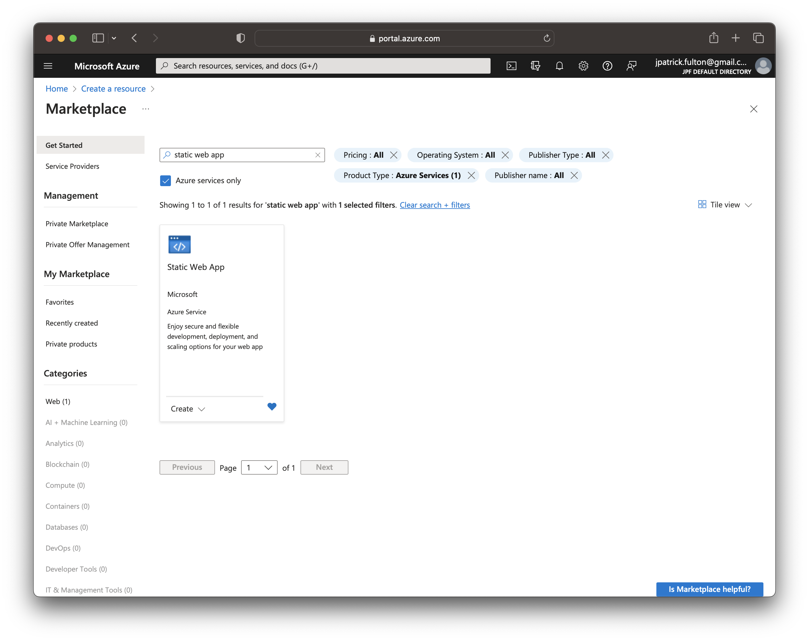
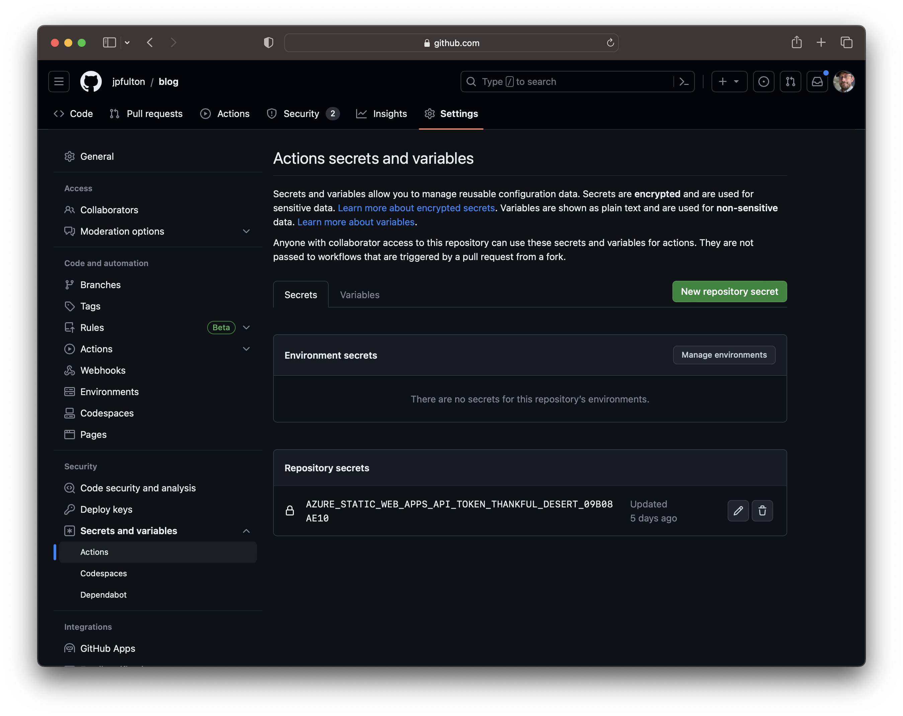

Publishing a [Gatsby](https://www.gatsbyjs.com/) website to
[Azure Static Web Apps](https://azure.microsoft.com/en-us/products/app-service/static)
using
[GitHub Actions](https://github.com/features/actions)
is fairly straight forward.

## Table of Contents

## Azure Configuration




## GitHub Configuration



```yaml{17}{numberLines: true}
build_and_deploy_job:
    if: github.event_name == 'push' || (github.event_name == 'pull_request' && github.event.action != 'closed')
    runs-on: ubuntu-latest
    name: Build and Deploy Job
    needs: analyze
    permissions:
        contents: read # for actions/checkout to fetch code
        pull-requests: write # for Azure/static-web-apps-deploy to comment on PRs
    steps:
        - uses: actions/checkout@v3
        with:
            submodules: true
        - name: Build And Deploy
        id: builddeploy
        uses: Azure/static-web-apps-deploy@v1
        with:
            azure_static_web_apps_api_token: ${{ secrets.AZURE_STATIC_WEB_APPS_API_TOKEN_THANKFUL_DESERT_09B08AE10 }}
            repo_token: ${{ secrets.GITHUB_TOKEN }} # Used for Github integrations (i.e. PR comments)
            action: "upload"
            ###### Repository/Build Configurations - These values can be configured to match your app requirements. ######
            # For more information regarding Static Web App workflow configurations, please visit: https://aka.ms/swaworkflowconfig
            app_location: "/" # App source code path
            api_location: "" # Api source code path - optional
            output_location: "public" # Built app content directory - optional
            ###### End of Repository/Build Configurations ######
```

## package.json Configuration

The [GitHub Action](https://github.com/Azure/static-web-apps-deploy) that was
utilitzed in the workflow file placed in the `.github` folder uses
[Microsoft Oryx](https://github.com/microsoft/Oryx) to build the repository.
At the time of this writing, [NodeJS](https://nodejs.org/en) v18+ was
not natively installed on its image. While Node v16 appears to be pre-installed,
Gatsby v5+ requires Node v18 or better. The Oryx system is equipped to
update itself with the dependencies that it requires if metadata is provided
to it that allows it to identify them. Modifying `package.json` provides
the information that the build engine will need to correctly run the later
versions of Gatsby.

Check your [NodeJS](https://nodejs.org/en) version with command below:

```shell{outputLines:2}
node -v
v18.16.0
```

Add or modify the following sections in `package.json` to provide Oryx
with the information it needs to recognize the node version and complete
the build process sucessfully.

```javascript:title=package.json {2}{numberLines:true}
"engines": {
    "node": ">=18.16.0"
},
```
