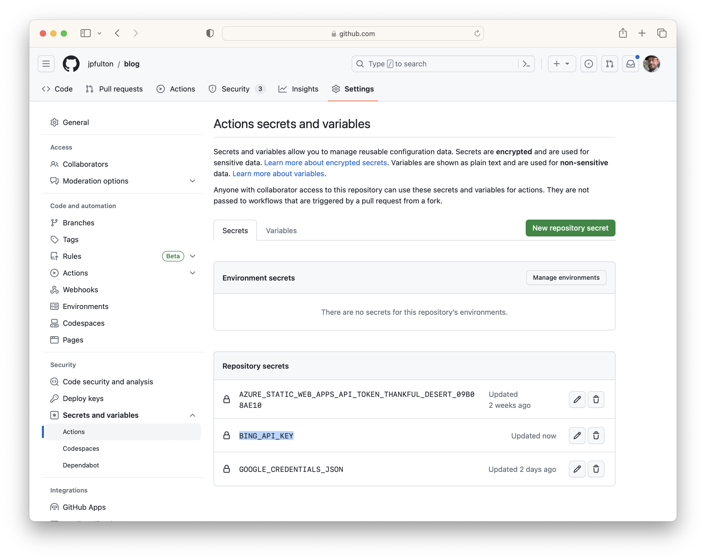
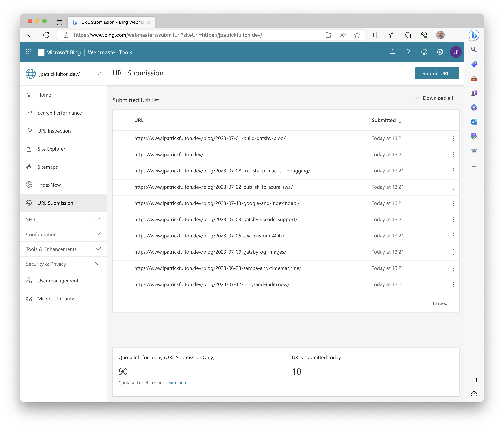

In a <Link to="/blog/2023-07-12-bing-and-indexnow/">previous post</Link>,
I discussed the challenges and delays associated with waiting for crawlers to
discover updated content and how to solve that issue for
[Microsoft Bing](https://www.bing.com) using
[IndexNow](https://www.indexnow.org/).

This article covers an integration with the
[Microsoft Bing Submission API](https://learn.microsoft.com/en-us/dotnet/api/microsoft.bing.webmaster.api.interfaces.iwebmasterapi.submiturlbatch?view=bing-webmaster-dotnet#Microsoft_Bing_Webmaster_Api_Interfaces_IWebmasterApi_SubmitUrlBatch_System_String_System_Collections_Generic_List_System_String__)
through [GitHub Actions](https://github.com/features/actions)
using a shell script to update the
[Microsoft Bing](https://www.bing.com) search engine with updated
URLs in this blog implementation upon each deployment of the site.

The evolving **GitHub repository** storing this blog and its implementation can be
found [here](https://github.com/jpfulton/blog).

## Table of Contents

## Prerequisites for the Bing Submission API

### Establishing Ownership with the Bing Webmaster Tools

[Bing Webmaster Tools](https://www.bing.com/webmasters/) is the portal
for establishing site ownership with Bing and managing URL submission,
tracking search performance and managing search engine optimization.
I observed a number of quirks when running the webmaster tools portal in
both Chrome and Safari. Those quirks can be avoided by utilizing
[Microsoft Edge](https://www.microsoft.com/en-us/edge/) when running the
portal.

If you are already a verified owner of one or more sites with Google, it is possible
to import your properties and verified ownership direct into Bing via an exchange
with [Google Search Console](https://search.google.com/search-console/). Other methods
for verifying site ownership are also available.

### Generating an API Key


## Structure of an IndexNow Request

The body of an Submission API request is a simple JSON object. It contains only two
properties: the site URL and a list of URLs to be submitted to the crawler.
It may be submitted using an HTTP `POST` to
`https://ssl.bing.com/webmaster/api.svc/json/SubmitUrlbatch` with a query parameter
that contains the API key.
It is important to set the `Content-Type` header
to `application/json; charset=utf-8` for the request to be accepted by the API.

```json
POST /webmaster/api.svc/json/SubmitUrlbatch?​apikey=sampleapikeyEDECC1EA4AE341CC8B6 HTTP/1.1
Content-Type: application/json; charset=utf-8
Host: ssl.bing.com
{
  "siteUrl": "https://www.jpatrickfulton.dev",
  "urlList": [
    "https://www.jpatrickfulton.dev/",
    "https://www.jpatrickfulton.dev/blog/2023-06-23-samba-and-timemachine/",
    "https://www.jpatrickfulton.dev/blog/2023-07-01-build-gatsby-blog/",
    "https://www.jpatrickfulton.dev/blog/2023-07-02-publish-to-azure-swa/",
    "https://www.jpatrickfulton.dev/blog/2023-07-03-gatsby-vscode-support/",
    "https://www.jpatrickfulton.dev/blog/2023-07-05-swa-custom-404s/",
    "https://www.jpatrickfulton.dev/blog/2023-07-08-fix-csharp-macos-debugging/",
    "https://www.jpatrickfulton.dev/blog/2023-07-09-gatsby-og-images/",
    "https://www.jpatrickfulton.dev/blog/2023-07-12-bing-and-indexnow/",
    "https://www.jpatrickfulton.dev/blog/2023-07-13-google-and-indexingapi/",
    ]
}
```

## The GitHub Actions Workflow

### Save the API Key as a Repository Secret



### Add the bing-url-submission-api.sh Shell Script

The URL structure of a generated [Gatsby](https://www.gatsbyjs.com/) site can be
derived from the structure of
the code that builds it. Therefore, a script that uses the structure of
the repository as its source material can be created that builds the URLs
of the pages that were generated is easy to create. Additionally, the
JSON structure of an Submission API request body is straight forward so creating
it in a shell script is possible with a series of `echo` commands directed
to a local working file. Once the temporary working file containing the JSON
request is created, `curl` can be used to submit the request to the Submission API.

```sh:title=bing-url-submission-api.sh {numberLines: true}
#!/usr/bin/env bash

# Configurable variables used in IndexNow call and URL construction
HOST="www.jpatrickfulton.dev"
BASE_URL="https://${HOST}"
BING_URL="https://ssl.bing.com"

BLOG_DIR=../../../content/blog/; # Location of /content/blog/ folder relative to tmp working dir

WORKING_DIR=$( pwd; );
TMP_DIR=$WORKING_DIR"/tmp";

LOCAL_CREDENTIALS_FILE=../bing-api-key.txt;
JSON_FILE=bing-submission-api-body.json;

# Create and enter the working directory if it does not exist
if [ ! -d $TMP_DIR ]
  then
    echo "Creating temporary working directory.";
    mkdir $TMP_DIR;
fi
cd $TMP_DIR;

echo "Building POST body from repository structure.";
if [ -f $JSON_FILE ]
  then
    rm $JSON_FILE;
fi

# Begin JSON body construction
touch $JSON_FILE;
echo "{" >> $JSON_FILE;
echo "  \"siteUrl\": \"${BASE_URL}\"," >> $JSON_FILE;
echo "  \"urlList\": [" >> $JSON_FILE;

# Add the root URL
echo "    \"${BASE_URL}/\"," >> $JSON_FILE;

# Iterate over folders in the /content/blog/ directory
# to create links to each individual generated blog page
BLOGS=($(ls $BLOG_DIR));
for BLOG in "${BLOGS[@]}"
do
  echo "    \"${BASE_URL}/blog/${BLOG}/\"," >> $JSON_FILE;
done

echo "    ]" >> $JSON_FILE;
echo "}" >> $JSON_FILE;
# JSON body constrction complete

echo "JSON POST body contents:";
cat $JSON_FILE;
echo;

# Look for a local api key file
if [ -f $LOCAL_CREDENTIALS_FILE ]
  then
    echo "Using local API key file.";
    BING_API_KEY=$(cat $LOCAL_CREDENTIALS_FILE);
  else
    echo "No local API key file found...";
    echo "Using the BING_API_KEY environment variable...";

    if [ -z "${BING_API_KEY}" ]
      then
        echo "BING_API_KEY is not set or is empty. Exiting.";
        exit 1;
    fi
fi

echo "---";
echo "Updating Bing through POST to Submission API...";
echo;

# Construct the Bing API URL
BING_API_URL="${BING_URL}/webmaster/api.svc/json/SubmitUrlbatch?apikey=${BING_API_KEY}";

# Use curl to POST the JSON content to Bing IndexNow endpoint
curl $BING_API_URL \
  -H "Content-Type: application/json; charset=utf-8" \
  -d "$(cat $JSON_FILE)" \
  -s \
  -i;

echo;
echo "---";
echo "Done.";
```

The complete current version of this script is available at this
[location](https://github.com/jpfulton/blog/blob/main/.github/scripts/bing-url-submission-api.sh).

### Add the Workflow Step

In the continuous integration workflow for this site, I added a step
to the primary job following the step that builds and deploys the
generated output of site to [Azure](https://azure.microsoft.com). The step is
configured to _only_ run for pushes to the default branch to ensure that it
only executes following production releases.

By default, GitHub Actions workflows run in a fairly restrictive user context.
The script above performs a number of operations that require elevated
permissions to perform in that space like creating a working directory
and files within it. As a result, the script must run in `sudo` mode to
work correctly. Per the
[GitHub Actions Documentation](https://docs.github.com/en/actions/using-github-hosted-runners/about-github-hosted-runners#administrative-privileges),
a passwordless sudo mode is available in the workflow context which makes
executing the script fairly painless.

Additionally, take note of the `--preserve-env` flag passed to the `sudo`
command. By default, sudo will reset environment variables for the new
command context. However, this script needs to accept the `BING_API_KEY`
variable for use within. To ensure that environment variable is available
to the script, this flag is used. The configuration of sudo in the Github
runners environment allows the use of this flag.

> **-E, --preserve-env**
>
> Indicates to the security policy that the user wishes to preserve their
> existing environment variables. The security policy may return an error
> if the user does not have permission to preserve the environment.

```yaml {3,7}{numberLines: true}
- name: Update Bing via Submission API
  env:
    BING_API_KEY: ${{ secrets.BING_API_KEY }}
  if: github.event_name == 'push'
  working-directory: ".github/scripts"
  shell: bash
  run: sudo --preserve-env ./bing-url-submission-api.sh
```

The complete current version of this workflow can be found at this
[location](https://github.com/jpfulton/blog/blob/main/.github/workflows/cicd.yml).

## Proving it Works


