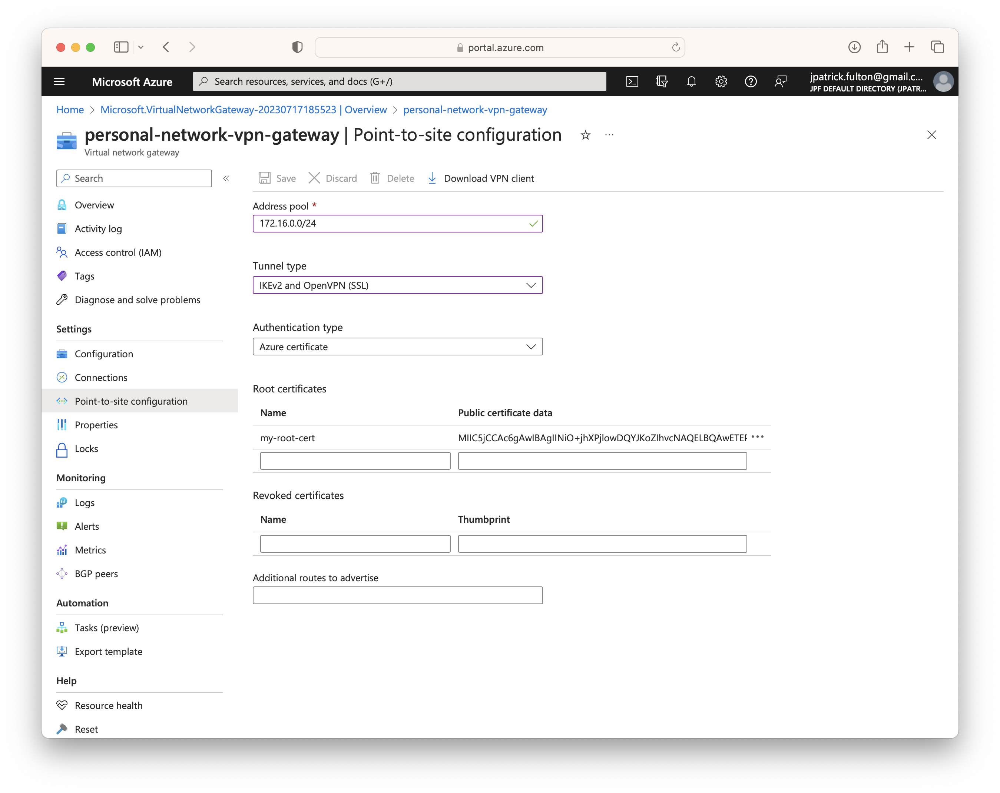

[documentation](https://learn.microsoft.com/en-us/azure/vpn-gateway/vpn-gateway-howto-point-to-site-resource-manager-portal)

import SeriesLinks from "../2023-07-18-azure-personal-network/seriesLinks.js"

<SeriesLinks />

## Table of Contents

## Create a VPN Gateway


## Configure the VPN Gateway

### Generate a Root Certificate

[generate certs documentation](https://learn.microsoft.com/en-us/azure/vpn-gateway/vpn-gateway-certificates-point-to-site-linux)

```bash
sudo apt update
sudo apt install strongswan
sudo apt install strongswan-pki
sudo apt install libstrongswan-extra-plugins
sudo apt install libtss2-rc0
```

```bash
ipsec pki --gen --outform pem > caKey.pem
ipsec pki --self --in caKey.pem --dn "CN=VPN CA" --ca --outform pem > caCert.pem
```

```bash
openssl x509 -in caCert.pem -outform der | base64 -w0 > my-root-cert.txt
```

### Configure Point-to-site



## Create a Client Configuration

### Download the Client Configuration Template


### OpenVPN Client Configuration Template

```sh
client
remote azuregateway-e287007a-007c-45ee-bbd1-a9f9f4ac4e9a-55b827be7af2.vpn.azure.com 443
verify-x509-name 'e287007a-007c-45ee-bbd1-a9f9f4ac4e9a.vpn.azure.com' name
remote-cert-tls server

dev tun
proto tcp
resolv-retry infinite
nobind

auth SHA256
cipher AES-256-GCM
persist-key
persist-tun

tls-timeout 30
tls-version-min 1.2
key-direction 1

log openvpn.log
verb 3

# P2S CA root certificate
<ca>
-----BEGIN CERTIFICATE-----
MIID...
-----END CERTIFICATE-----
</ca>

# Pre Shared Key
<tls-auth>
-----BEGIN OpenVPN Static key V1-----
8a50...
-----END OpenVPN Static key V1-----
</tls-auth>

# P2S client certificate
# Please fill this field with a PEM formatted client certificate
# Alternatively, configure 'cert PATH_TO_CLIENT_CERT' to use input from a PEM certificate file.
<cert>
$CLIENTCERTIFICATE
</cert>

# P2S client certificate private key
# Please fill this field with a PEM formatted private key of the client certificate.
# Alternatively, configure 'key PATH_TO_CLIENT_KEY' to use input from a PEM key file.
<key>
$PRIVATEKEY
</key>
```

### Generate a Client Certificate

[create client configs documentation](https://learn.microsoft.com/en-us/azure/vpn-gateway/point-to-site-vpn-client-cert-linux)

```sh:title=gen-client-key.sh
#!/usr/bin/env bash
PASSWORD="password"
USERNAME="Home"

ipsec pki --gen --outform pem > "${USERNAME}Key.pem"
ipsec pki --pub --in "${USERNAME}Key.pem" | ipsec pki --issue --cacert caCert.pem --cakey caKey.pem --dn "CN=${USERNAME}" --san "${USERNAME}" --flag clientAuth --outform pem > "${USERNAME}Cert.pem"

openssl pkcs12 -in "${USERNAME}Cert.pem" -inkey "${USERNAME}Key.pem" -certfile caCert.pem -export -out "${USERNAME}.p12" -password "pass:${PASSWORD}"
```

```bash
openssl pkcs12 -in "Home.p12" -nodes -out "profileinfo.txt"
```

### Assemble the Client Configuration File
