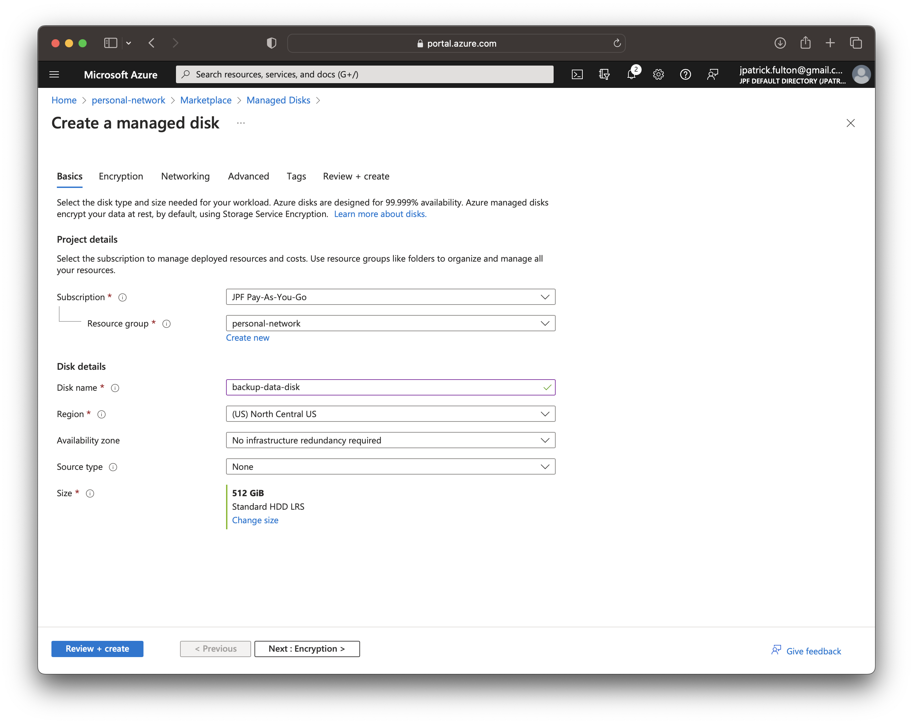
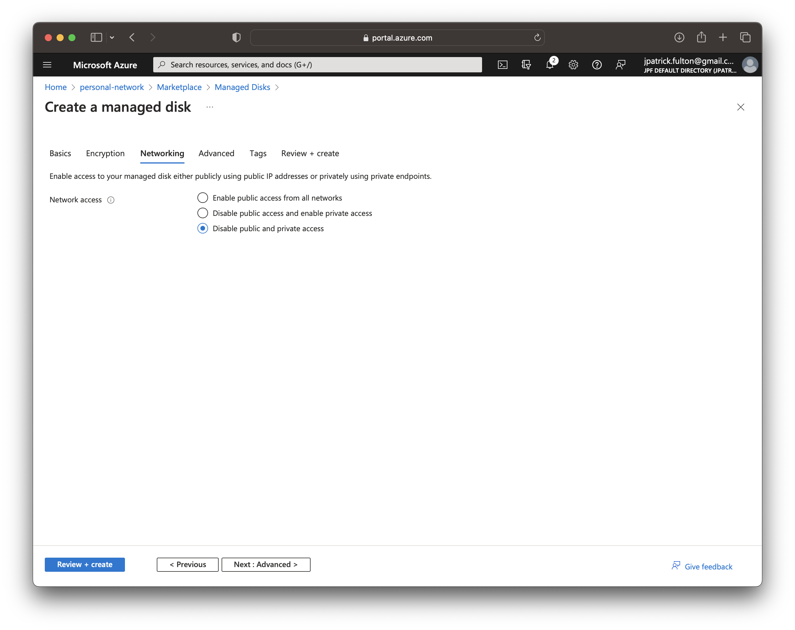
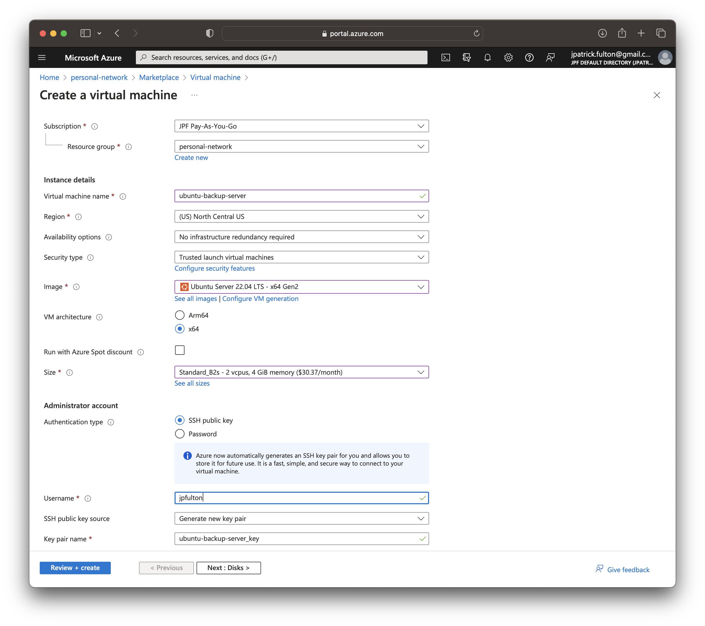
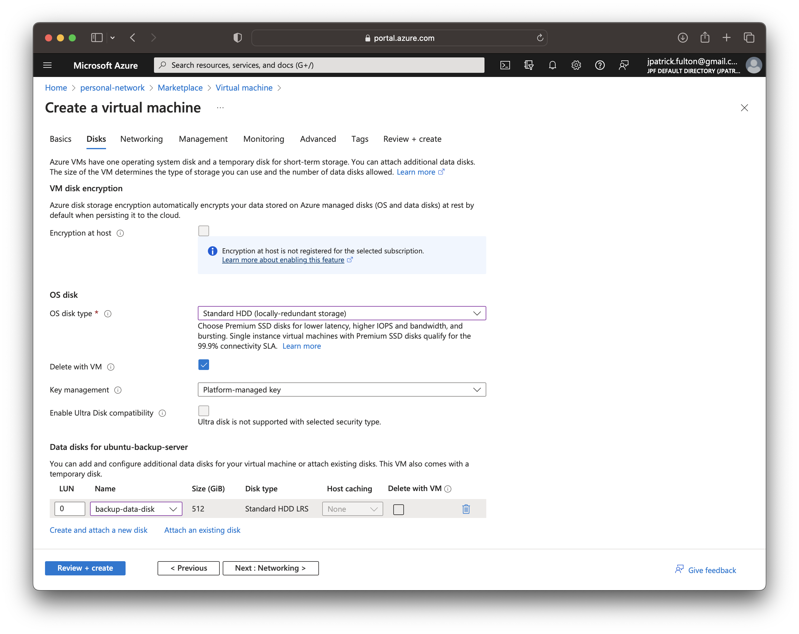
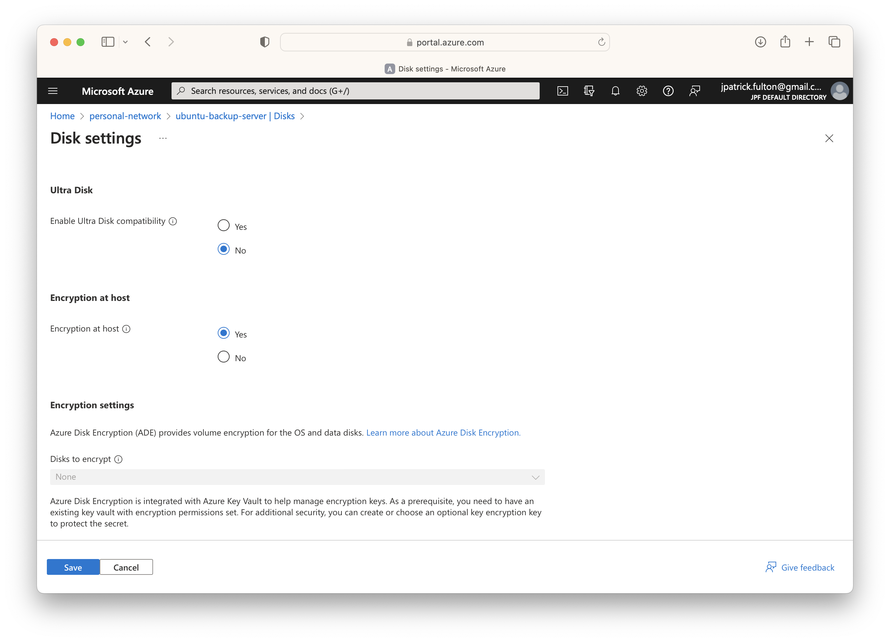

import SeriesLinks from "../2023-07-18-azure-personal-network/seriesLinks.js"

<SeriesLinks />

## Table of Contents

## Create a Managed Data Disk

Before we begin creating a virtual machine, we need a data disk. The virtual
machine creation process will initialize a disk for the operating system.
However, it is best to separate the backup data from the OS disk for a number
of reasons. Firstly, we will need more space than is available on the OS disk.
Additionally, we may wish to easily move the data disk between machines or use
the disk sharing features available on Azure Managed Disks.

From the resource group, select **Create** on the toolbar and search for
**Managed Disk** in the marketplace. Enter a name for the disk and select
a size. In this example, I am starting with a 512GB disk on a `Standard HDD`
model with locally redundant storage. Other premium models are available.
However, we will need neither their features, redundancy nor maximum IOPS
for this application.



On the networking tab, ensure that both public and private access are disabled.
We will not need them in this application and can elect to enable those features
in the future as warranted.



## Create a Virtual Machine

With a new data disk in place, we can begin to create a virtual machine
to host the Samba service and to which we can attach the disk. From
the resource group, select **Create** on the tool bar and search
for **Virtual Machine** in the marketplace.

Enter a name for the server on the first step, select
`Ubuntu Server 22.04 LTS` as the image and choose `Standard_B2s` as the
virtual machine size.



On the disks tab, change the `OS disk type` to `Standard HHD`. Under the
`Data disks` section, select **Attach an existing disk** and find the data
disk create in a previous step. Note that we will enable the `Encryption at host`
feature for this virtual machine in a later step.



On the networking tab, change the `Public IP` option to `None`. This virtual machine
will _only_ communicate on a private IP within the virtual network.


Select **Review + create** to validate and start the deployment. An `ssh` key will
be downloaded in the process.

## Configure the Virtual Machine

### Access the Virtual Machine via SSH

#### Use the Downloaded Private Key

#### Use Azure AD Authentication for SSH

[documentation](https://learn.microsoft.com/en-us/azure/active-directory/devices/howto-vm-sign-in-azure-ad-linux#configure-role-assignments-for-the-vm)

```bash {outputLines: 4-37}
az login
az extension add --name ssh
az extension show --name ssh
{
  "extensionType": "whl",
  "metadata": {
    "author": "Microsoft Corporation",
    "author_email": "azpycli@microsoft.com",
    "azext.isPreview": false,
    "azext.minCliCoreVersion": "2.45.0",
    "classifiers": [
      "Development Status :: 4 - Beta",
      "Intended Audience :: Developers",
      "Intended Audience :: System Administrators",
      "Programming Language :: Python",
      "Programming Language :: Python :: 3",
      "Programming Language :: Python :: 3.6",
      "Programming Language :: Python :: 3.7",
      "Programming Language :: Python :: 3.8",
      "License :: OSI Approved :: MIT License"
    ],
    "description": "SSH into Azure VMs using RBAC and AAD OpenSSH Certificates.  The client generates (or uses existing) OpenSSH keys that are then signed by AAD into OpenSSH certificates for access to Azure VMs with the AAD Extension installed.\n",
    "filename": "/Users/josephpfulton/.azure/cliextensions/ssh/ssh-2.0.0.dist-info",
    "home_page": "https://github.com/Azure/azure-cli-extensions/tree/main/src/ssh",
    "license": "MIT",
    "metadata_version": "2.0",
    "name": "ssh",
    "requires_dist": [
      "oschmod (==0.3.12)"
    ],
    "summary": "SSH into Azure VMs using RBAC and AAD OpenSSH Certificates",
    "version": "2.0.0"
  },
  "name": "ssh",
  "path": "/Users/josephpfulton/.azure/cliextensions/ssh",
  "version": "2.0.0"
}
```

```bash
az ssh vm --ip 10.10.0.4
```

### Update All Packages

```bash
sudo apt update
sudo apt list --upgradeable
sudo apt upgrade
```

### Set Up the Local Firewall

Edit `/etc/default/ufw` to turn of IPV6.

```bash {outputLines: 4-6, 9-14}
sudo ufw allow ssh
sudo ufw allow samba
sudo ufw show added
Added user rules (see 'ufw status' for running firewall):
ufw allow 22/tcp
ufw allow Samba
sudo ufw enable
sudo ufw status numbered
Status: active

     To                         Action      From
     --                         ------      ----
[ 1] 22/tcp                     ALLOW IN    Anywhere
[ 2] Samba                      ALLOW IN    Anywhere
```

### Mount and Format the Data Disk

```bash {2}{numberLines: true}{outputLines: 2-8}
ls -la /dev/sd*
brw-rw---- 1 root disk 8,  0 Jul 18 03:06 /dev/sda
brw-rw---- 1 root disk 8, 16 Jul 18 03:06 /dev/sdb
brw-rw---- 1 root disk 8, 17 Jul 18 03:06 /dev/sdb1
brw-rw---- 1 root disk 8, 30 Jul 18 03:06 /dev/sdb14
brw-rw---- 1 root disk 8, 31 Jul 18 03:06 /dev/sdb15
brw-rw---- 1 root disk 8, 32 Jul 18 03:06 /dev/sdc
brw-rw---- 1 root disk 8, 33 Jul 18 03:06 /dev/sdc1
```

```bash {6}{numberLines: true}{outputLines: 2-13}
lsblk
NAME    MAJ:MIN RM   SIZE RO TYPE MOUNTPOINTS
loop0     7:0    0  63.4M  1 loop /snap/core20/1950
loop1     7:1    0 111.9M  1 loop /snap/lxd/24322
loop2     7:2    0  53.3M  1 loop /snap/snapd/19457
sda       8:0    0   512G  0 disk
sdb       8:16   0    30G  0 disk
├─sdb1    8:17   0  29.9G  0 part /
├─sdb14   8:30   0     4M  0 part
└─sdb15   8:31   0   106M  0 part /boot/efi
sdc       8:32   0     8G  0 disk
└─sdc1    8:33   0     8G  0 part /mnt
sr0      11:0    1   628K  0 rom
```

```bash
sudo fdisk /dev/sda
```

`p` to view current partitions

`n` then `p` to create a new primary partition, accept defaults

`sudo mkfs.ext4 /dev/sda1`

`sudo mkdir /backup`

`sudo mount -t ext4 -o rw /dev/sda1 /backup`

```bash {6-7}{numberLines: true}{outputLines: 2-14}
lsblk
NAME    MAJ:MIN RM   SIZE RO TYPE MOUNTPOINTS
loop0     7:0    0  63.4M  1 loop /snap/core20/1950
loop1     7:1    0 111.9M  1 loop /snap/lxd/24322
loop2     7:2    0  53.3M  1 loop /snap/snapd/19457
sda       8:0    0   512G  0 disk
└─sda1    8:1    0   512G  0 part /backup
sdb       8:16   0    30G  0 disk
├─sdb1    8:17   0  29.9G  0 part /
├─sdb14   8:30   0     4M  0 part
└─sdb15   8:31   0   106M  0 part /boot/efi
sdc       8:32   0     8G  0 disk
└─sdc1    8:33   0     8G  0 part /mnt
sr0      11:0    1   628K  0 rom
```

### Modify fstab

Run `blkid` to identify the UUID of the new filesystem. Using the UUID
is the **only** reliable way to ensure a clean mount in between boots on
a virtual machine.

```bash {2}{numberLines: true}{outputLines: 2-10}
sudo blkid
/dev/sda1: UUID="e562be7f-ffa0-46df-b57a-16e0b265aea1" BLOCK_SIZE="4096" TYPE="ext4" PARTUUID="b56e4a70-01"
/dev/sdc1: UUID="44accf23-56c1-486a-af6b-a2146d6a8a63" BLOCK_SIZE="4096" TYPE="ext4" PARTUUID="98e21008-01"
/dev/sdb15: LABEL_FATBOOT="UEFI" LABEL="UEFI" UUID="B6C3-B75F" BLOCK_SIZE="512" TYPE="vfat" PARTUUID="a295d76d-648c-4a4b-a3e0-b6307dd6e209"
/dev/sdb1: LABEL="cloudimg-rootfs" UUID="1c12acfb-8f0c-440f-b6b7-6c22c1f36e1e" BLOCK_SIZE="4096" TYPE="ext4" PARTUUID="ee1583fb-fd94-4b13-98b6-5f25e7fa4580"
/dev/loop1: TYPE="squashfs"
/dev/loop2: TYPE="squashfs"
/dev/loop0: TYPE="squashfs"
/dev/loop3: TYPE="squashfs"
/dev/sdb14: PARTUUID="b857fc35-18dc-48df-b3f0-ae83aa33b319"
```

Edit `/etc/fstab` with `sudo vim /etc/fstab`.

```sh:title=/etc/fstab {5}{numberLines: true}
# CLOUD_IMG: This file was created/modified by the Cloud Image build process
UUID=1c12acfb-8f0c-440f-b6b7-6c22c1f36e1e /  ext4 discard,errors=remount-ro 0 1
UUID=B6C3-B75F /boot/efi vfat umask=0077 0 1
/dev/disk/cloud/azure_resource-part1 /mnt auto defaults,nofail,x-systemd.requires=cloud-init.service,_netdev,comment=cloudconfig 0 2
UUID=e562be7f-ffa0-46df-b57a-16e0b265aea1 /backup ext4 rw 0 0
```

Restart with `sudo shutdown -r` to prove `/etc/fstab` changes, won't boot if you failed.

### Encrypt the Disks

[documentation](https://learn.microsoft.com/en-us/azure/virtual-machines/linux/disk-encryption-linux?tabs=azcliazure%2Cenableadecli%2Cefacli%2Cadedatacli)

[encrypt at host documentation](https://learn.microsoft.com/en-us/azure/virtual-machines/disks-enable-host-based-encryption-portal?tabs=azure-powershell)

```bash {outputLines: 3-11}
az login
az feature register --name EncryptionAtHost  --namespace Microsoft.Compute
Once the feature 'EncryptionAtHost' is registered, invoking 'az provider register -n Microsoft.Compute' is required to get the change propagated
{
  "id": "/subscriptions/4913be3f-a345-4652-9bba-767418dd25e3/providers/Microsoft.Features/providers/Microsoft.Compute/features/EncryptionAtHost",
  "name": "Microsoft.Compute/EncryptionAtHost",
  "properties": {
    "state": "Registering"
  },
  "type": "Microsoft.Features/providers/features"
}
```

Wait a few minutes or more until the output shows `Registered`.

```bash {outputLines: 2-9}
az feature show --name EncryptionAtHost --namespace Microsoft.Compute
{
  "id": "/subscriptions/4913be3f-a345-4652-9bba-767418dd25e3/providers/Microsoft.Features/providers/Microsoft.Compute/features/EncryptionAtHost",
  "name": "Microsoft.Compute/EncryptionAtHost",
  "properties": {
    "state": "Registered"
  },
  "type": "Microsoft.Features/providers/features"
}
```

To propagate the change per output of earlier command.

```bash
az provider register -n Microsoft.Compute
```

Stop the virtual machine. Then Disks > Additional Settings > Encryption at host: Yes, Save.



Start the VM. Log in.

### Install Samba

```bash
sudo apt install samba
```

#### Create Dedicated Samba User and Group

```bash
sudo addgroup smbgroup
sudo adduser --system --no-create-home --ingroup smbgroup smbuser
```

#### Create Share Folders and Change Ownership

```bash {outputLines: 7-12}
cd /backup
sudo mkdir applebackups
sudo mkdir linuxbackups
sudo chown smbuser:smbgroup applebackups
sudo chown smbuser:smbgroup linuxbackups
ls -la
total 32
drwxr-xr-x  5 root    root      4096 Jul 18 04:31 .
drwxr-xr-x 20 root    root      4096 Jul 18 03:51 ..
drwxr-xr-x  2 smbuser smbgroup  4096 Jul 18 04:26 applebackups
drwxr-xr-x  3 smbuser smbgroup  4096 Jul 18 04:45 linuxbackups
drwx------  2 root    root     16384 Jul 18 03:38 lost+found
```

#### Create Samba Users for Share Access

```bash
sudo adduser --no-create-home --shell /sbin/nologin applebackup
sudo smbpasswd -a applebackup
```

```bash
sudo adduser --no-create-home --shell /sbin/nologin linuxbackup
sudo smbpasswd -a linuxbackup
```

#### Edit /etc/samba/smb.conf to Configure Samba

```bash
sudo vim /etc/samba/smb.conf
```

#### Restart the Samba Service

```bash
sudo systemctl restart samba
```

## Monitor Disk Usage

### Monitor from a Command

```bash {outputLines:2-10}
df -H
Filesystem      Size  Used Avail Use% Mounted on
/dev/root        32G  2.5G   29G   8% /
tmpfs           2.1G     0  2.1G   0% /dev/shm
tmpfs           811M  4.7M  806M   1% /run
tmpfs           5.3M     0  5.3M   0% /run/lock
/dev/sdb15      110M  6.4M  104M   6% /boot/efi
/dev/sda1       540G  111G  402G  22% /backup
/dev/sdc1       8.4G   29k  8.0G   1% /mnt
tmpfs           406M  4.1k  406M   1% /run/user/1000
```

### Setup Monitoring and System Status using the MOTD

`/etc/update-motd.d/`

```bash
sudo apt install neofetch
sudo apt install inxi
```

```bash
sudo vim /etc/update-motd.d/01-custom
```

```sh:title=/etc/update-motd.d/01-custom
#!/bin/sh
echo
echo "General System Information:"
echo
/usr/bin/neofetch --disable title --color_blocks off

echo
echo "System Disk Usage:"
/usr/bin/inxi -D -p
```

```bash
sudo chmod a+x /etc/update-motd.d/01-custom
```

Logout and log back in.

```txt
Welcome to Ubuntu 22.04.2 LTS (GNU/Linux 5.15.0-1041-azure x86_64)

General System Information:

            .-/+oossssoo+/-.
        `:+ssssssssssssssssss+:`           OS: Ubuntu 22.04.2 LTS x86_64
      -+ssssssssssssssssssyyssss+-         Host: Virtual Machine Hyper-V UEFI R
    .ossssssssssssssssssdMMMNysssso.       Kernel: 5.15.0-1041-azure
   /ssssssssssshdmmNNmmyNMMMMhssssss/      Uptime: 13 hours, 50 mins
  +ssssssssshmydMMMMMMMNddddyssssssss+     Packages: 793 (dpkg), 4 (snap)
 /sssssssshNMMMyhhyyyyhmNMMMNhssssssss/    Shell: bash 5.1.16
.ssssssssdMMMNhsssssssssshNMMMdssssssss.   Resolution: 1024x768
+sssshhhyNMMNyssssssssssssyNMMMysssssss+   Terminal: run-parts
ossyNMMMNyMMhsssssssssssssshmmmhssssssso   CPU: Intel Xeon E5-2673 v3 (2) @ 2.3
ossyNMMMNyMMhsssssssssssssshmmmhssssssso   Memory: 425MiB / 3863MiB
+sssshhhyNMMNyssssssssssssyNMMMysssssss+
.ssssssssdMMMNhsssssssssshNMMMdssssssss.
 /sssssssshNMMMyhhyyyyhdNMMMNhssssssss/
  +sssssssssdmydMMMMMMMMddddyssssssss+
   /ssssssssssshdmNNNNmyNMMMMhssssss/
    .ossssssssssssssssssdMMMNysssso.
      -+sssssssssssssssssyyyssss+-
        `:+ssssssssssssssssss+:`
            .-/+oossssoo+/-.


System Disk Usage:
Drives:
  Local Storage: total: 550 GiB used: 109.32 GiB (19.9%)
  ID-1: /dev/sda model: Virtual Disk size: 512 GiB
  ID-2: /dev/sdb model: Virtual Disk size: 30 GiB
  ID-3: /dev/sdc model: Virtual Disk size: 8 GiB
Partition:
  ID-1: / size: 28.89 GiB used: 2.62 GiB (9.1%) fs: ext4 dev: /dev/sdb1
  ID-2: /backup size: 502.89 GiB used: 106.7 GiB (21.2%) fs: ext4 dev: /dev/sda1
  ID-3: /boot/efi size: 104.4 MiB used: 6 MiB (5.8%) fs: vfat dev: /dev/sdb15
  ID-4: /mnt size: 7.77 GiB used: 28 KiB (0.0%) fs: ext4 dev: /dev/sdc1
```
