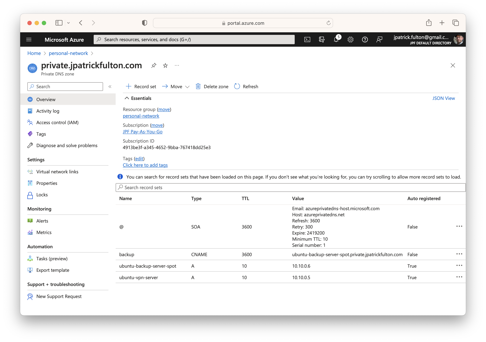

import SeriesLinks from "../2023-07-18-azure-personal-network/seriesLinks.js"

<SeriesLinks />

## Table of Contents

## Create and Initialize the Spot VM Instance

## Perform Initial Samba Configuration

- Install Samba
- Create Local Samba User and Group
- Create Samba Passwords for Use in Shares
- Copy Configuration from Existing Server

## Shutdown the Existing Backup Server

## Snapshot Backup Data Disk

## Detach the Data Disk from the Existing Backup Server

## Attach the Data Disk to the Spot VM

Can be performed while server is running.

```bash {8-9}{numberLines: true}{outputLines: 2-9}
ls -la /dev/sd*
brw-rw---- 1 root disk 8,  0 Jul 24 18:27 /dev/sda
brw-rw---- 1 root disk 8,  1 Jul 24 18:27 /dev/sda1
brw-rw---- 1 root disk 8, 14 Jul 24 18:27 /dev/sda14
brw-rw---- 1 root disk 8, 15 Jul 24 18:27 /dev/sda15
brw-rw---- 1 root disk 8, 16 Jul 24 18:27 /dev/sdb
brw-rw---- 1 root disk 8, 17 Jul 24 18:27 /dev/sdb1
brw-rw---- 1 root disk 8, 32 Jul 24 19:18 /dev/sdc
brw-rw---- 1 root disk 8, 33 Jul 24 19:18 /dev/sdc1
```

```bash {13-14}{numberLines: true}{outputLines: 2-14}
lsblk
NAME    MAJ:MIN RM   SIZE RO TYPE MOUNTPOINTS
loop0     7:0    0  63.4M  1 loop /snap/core20/1974
loop1     7:1    0  53.3M  1 loop /snap/snapd/19457
loop2     7:2    0  63.4M  1 loop /snap/core20/1950
loop3     7:3    0 111.9M  1 loop /snap/lxd/24322
sda       8:0    0    30G  0 disk
├─sda1    8:1    0  29.9G  0 part /
├─sda14   8:14   0     4M  0 part
└─sda15   8:15   0   106M  0 part /boot/efi
sdb       8:16   0    16G  0 disk
└─sdb1    8:17   0    16G  0 part /mnt
sdc       8:32   0     1T  0 disk
└─sdc1    8:33   0  1024G  0 part
```

```bash
sudo mkdir /backup
sudo mount -t ext4 -o rw /dev/sdc1 /backup
```

```bash {5-6}{numberLines: true}{outputLines: 2-7}
ls -la /backup/
total 32
drwxr-xr-x  5 root    root        4096 Jul 18 04:31 .
drwxr-xr-x 22 root    root        4096 Jul 24 19:22 ..
drwxr-xr-x  3 smbuser aad_admins  4096 Jul 24 14:52 applebackups
drwxr-xr-x  3 smbuser aad_admins  4096 Jul 18 04:45 linuxbackups
drwx------  2 root    root       16384 Jul 18 03:38 lost+found
```

Change group ownership recursively.

```bash
sudo chown -R smbuser:smbgroup /backup/applebackups
sudo chown -R smbuser:smbgroup /backup/linuxbackups
```

Modify `/etc/fstab`.

```sh {5}{numberLines: true}
# CLOUD_IMG: This file was created/modified by the Cloud Image build process
UUID=1c12acfb-8f0c-440f-b6b7-6c22c1f36e1e       /        ext4   discard,errors=remount-ro       0 1
UUID=B6C3-B75F  /boot/efi       vfat    umask=0077      0 1
/dev/disk/cloud/azure_resource-part1    /mnt    auto    defaults,nofail,x-systemd.requires=cloud-init.service,_netdev,comment=cloudconfig       0       2
/dev/sdc1 /backup ext4 rw 0 0
```

Reboot with `sudo shutdown -r`.

Validate filesystem upon reboot.

## Update the Local Firewall

```bash
sudo ufw allow samba
sudo ufw status numbered
```

## Start the Samba Service

```bash
sudo systemctl start smbd
sudo systemctl status smbd
```

## Create a convenient CNAME on the private DNS Zone



## Reconfigure Apple Clients


Note existing backups that were encrypted may need to be recreated as the
encryption password is associated with host name?

## Reconfigure Linux Clients

## Clean up by Deleting the Original Server and Snapshot

- Deleting the old backup server takes the OS disk and NIC with it
- The NSG for the NIC needs manual cleanup
- Delete the data disk snapshot


