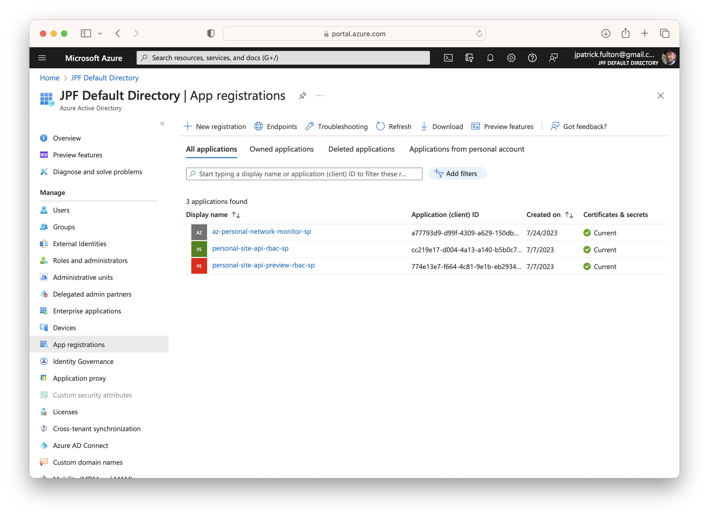
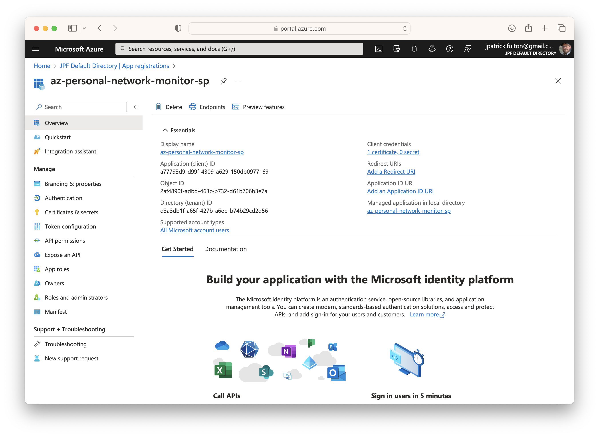

In the <Link to="/blog/2023-07-24-azure-personal-network-spot-instance/">last post</Link>,
we developed a resilient mechanism to gracefully shutdown an interruptible
workflow on an
[Azure Spot Virtual Machine](https://azure.microsoft.com/en-us/products/virtual-machines/spot).
In this post, we create an external orchestration to restart the spot instances
once capacity has been freed within the Azure data center.

The external orchestration must run outside the spot instances for stability as it
is always possible that a spot instance will be deallocated with little warning.
Options for its location include an on-premise server or a traditional virtual
machine. I selected an on-premise
[Ubuntu](https://ubuntu.com/) server as the host for this project.

The orchestration is implemented using the Azure CLI and a series of
`bash` scripts. It is scheduled for execution using `cron` with output
directed to `syslogd`.

import SeriesLinks from "../2023-07-18-azure-personal-network/seriesLinks.js"

<SeriesLinks />

## Table of Contents

## Tag the Virtual Machine(s)

It may not be desirable for a spot instance to be restarted following deallocation
in all cases. For example, a spot instance may have been purposefully stopped
and deallocated for administrative reasons or its workload may have simply come
to an end. As a result, we need an easily configurable mechanism to mark spot
instances that should be restarted following eviction.

[Azure Tags](https://learn.microsoft.com/en-us/azure/azure-resource-manager/management/tag-resources)
offer an excellent solution to this problem. They are easy to create
and modify using both the portal and the
[Azure CLI](https://learn.microsoft.com/en-us/cli/azure/).
Additionally, they can be included in Azure CLI queries in the
[JMESPath](https://jmespath.org) syntax used by that tool.

The orchestration script used here uses tags to drive its logic. To be eligible
for attempted restart following eviction, the script expects a spot instance
to have a tag of `AttemptRestartAfterEviction` with a value of `true` to be
eligible for the orchestration.

The screen shot below shows the backup server spot instance with the tag applied.


The Azure CLI can also be used to
[work with tags](https://learn.microsoft.com/en-us/azure/azure-resource-manager/management/tag-resources-cli).

```bash {outputLines: 2-12}
az tag list --resource-id /subscriptions/4913be3f-a345-4652-9bba-767418dd25e3/resourcegroups/personal-network/providers/Microsoft.Compute/virtualMachines/ubuntu-backup-server-spot
{
  "id": "/subscriptions/4913be3f-a345-4652-9bba-767418dd25e3/resourceGroups/personal-network/providers/Microsoft.Compute/virtualMachines/ubuntu-backup-server-spot/providers/Microsoft.Resources/tags/default",
  "name": "default",
  "properties": {
    "tags": {
      "AttemptRestartAfterEviction": "true"
    }
  },
  "resourceGroup": "personal-network",
  "type": "Microsoft.Resources/tags"
}
```

## Create a Service Principal

The orchestration needs to run without user intervention or access to a browser
which is the usual behavior of the `az login` command. Additionally, the default
login mechanism is designed for users and your user account is likely to have
permissions and roles that are far greater in scope than would be desired
for use in an automated script. As a result, we need a different mechanism
to log into the Azure CLI inside the orchestration.

[Azure Service Principals](https://learn.microsoft.com/en-us/cli/azure/create-an-azure-service-principal-azure-cli#4-sign-in-using-a-service-principal)
are the solution to this problem.

> An Azure service principal is an identity created for use with applications,
> hosted services, and automated tools to access Azure resources. This access is
> restricted by the roles assigned to the service principal, giving you control
> over which resources can be accessed and at which level.

In this step, we will use the script below to create a service principal
with `contributor` access to the resource group containing our spot instances.
The script will generate a _self-signed_ certificate for use in authentication
with the Azure CLI within the orchestration.

Replace the empty variable values with the subscription ID, resource group
name and select a name for the service principal to be created prior
to execution.

```sh {clipboardButton: true}
#!/usr/bin/env bash

SUBSCRIPTION_ID="";
RESOURCE_GROUP="";
SP_NAME="";

az ad sp create-for-rbac
  --name $SP_NAME \
  --role contributor \
  --scopes /subscriptions/$SUBSCRIPTION_ID/resourceGroups/$RESOURCE_GROUP \
  --create-cert;
```

The service principal creation script can be found
[here](https://github.com/jpfulton/example-linux-configs/blob/main/home/jpfulton/create-azure-rbac-sp-for-resource-group.sh).

The output of the script will be printed to the console. We will need
several values from it to configure the orchestration script in a later
step: `appId` and `tenant`. The certificate file we need was generated
and placed at the path listed in the `fileWithCertAndPrivateKey` value.

```json
{
  "appId": "a77793d9-d99f-4309-a629-150db0977169",
  "displayName": "az-personal-network-monitor-sp",
  "fileWithCertAndPrivateKey": "/Users/josephpfulton/tmp3wenah5y.pem",
  "password": null,
  "tenant": "d3a3db1f-a65f-427b-a6eb-b74b29cd2d56"
}
```

The results of this operation can also be found in the Azure Portal.
Navigate to **Azure Active Directory** from the home screen then select
**App registrations** from the **Manage** menu. Should you lose the output
of the script that was run above, the values needed for the next steps
are available on these screens (with the exception of the certificate file).



Select the app registration matching the SP name you selected for the script
to get its details.



## Move and Protect the Service Principal Certificate

Per the output of the service principal creation script, a `PEM` file
containing a public / private key pair was generated at
`/Users/josephpfulton/tmp3wenah5y.pem`. This certificate will be used
to authenticate the Azure CLI in the monitoring orchestration. It needs
to be _**securely**_ moved to the orchestration server. Use
[scp](https://manpages.ubuntu.com/manpages/jammy/en/man1/scp.1.html)
to transfer the file.

The monitoring script expects the PEM file to have a specific name
and location: `/etc/azure/sp.pem`. Move and rename the file as needed.
Once in place, change its ownership to the root user and group then
restrict its file permissions. Delete the original local file.

```bash
sudo chown root:root /etc/azure/sp.pem
sudo chmod 0440 /etc/azure/sp.pem
```

## Install the Monitoring Script

The monitoring script listed below is intended to run as root or
in a sudo context. As such it should be located in `/usr/local/sbin`
and be owned by the root user and group.

### Install Script Prerequisites

The script should run without problems on a vanilla Ubuntu installation
with one exception: the Azure CLI needs to be installed.

To perform the installation, you may follow this
[Microsoft Guide](https://learn.microsoft.com/en-us/cli/azure/install-azure-cli-linux?pivots=apt)
or **following a careful review** you may use this
[script](https://github.com/jpfulton/example-linux-configs/blob/main/home/jpfulton/install-az-cli-with-extensions.sh).

### The Monitoring Script

The monitoring script may be run in a sudo context manually for debugging
purposes. However, it is designed to be scheduled via `cron`. A `crontab`
snippet file is provided in a section below. Replace the values stored
in the variables at the top of the script with values configured to your
installation.

The script is written to respect a lock file so that only one instance may
be executing at the same time. In most cases, the runtime will be short. However,
when a spot instance has been found that requires a restart attempt, the script
may become long running while it waits for the spot virtual machine to enter
a running state. The lock file contains the currently running process ID and
is located in `/etc/azure/deallocation-monitor.lock`.

Using service principal credentials, the script logs into the Azure CLI and
then queries for spot instances that have been deallocated using a
[JMESPath](https://jmespath.org/) query:

```sh
[?
  billingProfile.maxPrice != null &&
  powerState == 'VM deallocated' &&
  tags.AttemptRestartAfterEviction &&
  tags.AttemptRestartAfterEviction == 'true'
].{Name:name}
```

Returning a list of resource names, the query has four criteria.
A non-null value for the `billingProfile.maxPrice` key identifies the
virtual machine as a spot instance. Secondly, the `powerState` key criteria
must show the virtual machine as deallocated. Finally, the machine must
have a tag with the name `AttemptRestartAfterEviction` and a value of `true`.

Once a list of deallocated spot instances with the appropriate control tags
is found, the script will start each one in the order they were returned
by the query, awaiting each one to complete its start process prior to moving
on to the next.

Although not yet implemented here, this script could be modified to avoid waiting for
the long running virtual machine start process by adding
the `--no-wait` flag to the `az vm start` command. Logic would need to
included to follow up on the batch of start commands that were issued
in that hypothetical implementation.

```sh {clipboardButton: true}
#!/usr/bin/env bash

RESOURCE_GROUP="personal-network";
SP_APP_ID="a77793d9-d99f-4309-a629-150db0977169"; # REPLACE WITH YOUR SP APPID
SP_TENANT_ID="d3a3db1f-a65f-427b-a6eb-b74b29cd2d56"; # REPLACE WITH YOUR SP TENANTID

# ensure this script is running as root or sudo
if [ $(id -u) -ne 0 ]
  then
    echo "This script must be run as root or in a sudo context. Exiting.";
    exit 1;
fi

CONFIG_DIR="/etc/azure";
LOCK_FILE="${CONFIG_DIR}/deallocation-monitor.lock";
if [ ! -d $CONFIG_DIR ]
 then
  echo "Configuration directory does not exist. Creating...";
  mkdir $CONFIG_DIR;
fi

# This script can be long running. Use a lock file.
if [ -f $LOCK_FILE ]
 then
  echo "Found lock file.";
  RUNNING_PID=$(cat $LOCK_FILE);
  if [ ! -n "$(ps -p $RUNNING_PID -o pid=)" ]
   then
    echo "Lock file is stale. Removing and continuing...";
    rm $LOCK_FILE;
   else
    echo "Another instance of this script is running at PID: ${RUNNING_PID}. Exiting...";
    exit 0;
  fi
 else
  touch $LOCK_FILE;
  echo $BASHPID > $LOCK_FILE;
fi

# Attempt az login using service principal
SP_PEM_FILE="${CONFIG_DIR}/sp.pem";
if [ ! -f $SP_PEM_FILE ]
 then
  echo "Azure Service Principal PEM not found. Create one prior to using this script...";
  rm $LOCK_FILE;
  exit 1;
 else
  az account show > /dev/null 2>&1;
  if [ $? -ne 0 ]
   then
    echo "Logging in with Azure Service Principal PEM...";
    az login \
     --service-principal \
     --username ${SP_APP_ID} \
     --tenant ${SP_TENANT_ID} \
     --password ${SP_PEM_FILE} > /dev/null 2>&1;

    if [ $? -ne 0 ]
     then
      echo "Error: Unable to login. Exiting.";
      rm $LOCK_FILE;
      exit 1;
    fi
   else
    echo "Already logged in to Azure. Continuing...";
  fi
fi

echo "Querying for deallocated VMs tagged for restart after eviction...";
SPOT_ALLOCATION_QUERY="
 [?
  billingProfile.maxPrice != null &&
  powerState == 'VM deallocated' &&
  tags.AttemptRestartAfterEviction &&
  tags.AttemptRestartAfterEviction == 'true'
 ].{Name:name}";

DEALLOCATED_VM_NAMES=$(az vm list -g ${RESOURCE_GROUP} -d -o tsv --query "${SPOT_ALLOCATION_QUERY}");

VM_NAMES_ARRAY=($DEALLOCATED_VM_NAMES);
ARRAY_LENGTH=${#VM_NAMES_ARRAY[@]};

if [ $ARRAY_LENGTH -ge 1 ]
 then
  echo "Found ${ARRAY_LENGTH} deallocated VM(s) tagged for restart after eviction.";

  for (( i=0; i<$ARRAY_LENGTH; i++ ));
  do
   echo "Attempting to start VM: ${VM_NAMES_ARRAY[i]}";
   az vm start -g ${RESOURCE_GROUP} --name ${VM_NAMES_ARRAY[i]};
  done

 else
  echo "No deallocated VMs tagged for restart after eviction discovered.";
fi

# Remove lock file.
rm $LOCK_FILE;
```

A current version of this monitoring and orchestration script can be found
[here](https://github.com/jpfulton/example-linux-configs/blob/main/usr/local/sbin/monitor-and-restart-spot-vms.sh).

### Install the Crontab Snippet

With the logic of the script in place, the next step is to schedule its execution.
This is accomplished by placing a crontab snippet into the `/etc/cron.d/` directory.
The configured schedule in this example runs the monitoring script every minute.

To support logging to `syslogd`, both the `stdout` and `stderr` outputs of the
script are directed to the `logger` command with a tag of `az-spot-monitor`.
Outputs from the script will be available in `/var/log/syslog`.

```sh {clipboardButton: true}
# /etc/cron.d/az-spot-monitor: crontab entries for the az spot vm monitor script

SHELL=/bin/sh
PATH=/usr/sbin:/usr/bin:/sbin:/bin

* * * * * root ( /usr/local/sbin/monitor-and-restart-spot-vms.sh ) 2>&1 | logger -t az-spot-monitor

```

A current version of this crontab snippet can be found
[here](https://github.com/jpfulton/example-linux-configs/blob/main/etc/cron.d/az-spot-monitor).

## Simulate an Eviction

With the external reallocation orchestration in place, we should now be able to
simulate an eviction with the command below and expect both a graceful shutdown
of the workload as well as the orchestration to bring the spot instance back up
once it is deallocated.

```bash
az vm simulate-eviction --resource-group personal-network --name ubuntu-backup-server-spot
```

From the orchestration server, we can watch the progress of this process by
observing `/var/log/syslog` and filtering for tags matching the orchestration
script using the following command:

```bash
sudo tail -f /var/log/syslog | grep az-spot-monitor
```
